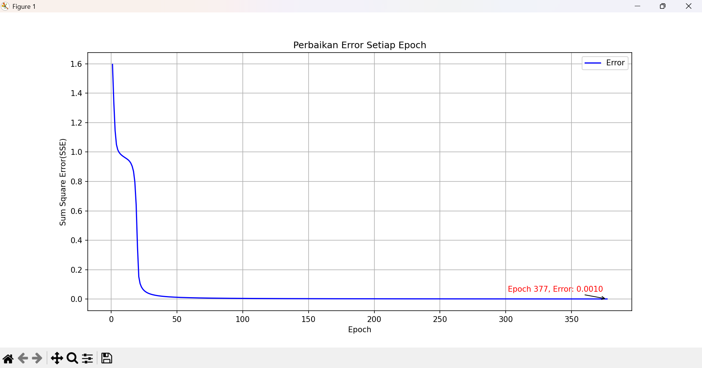
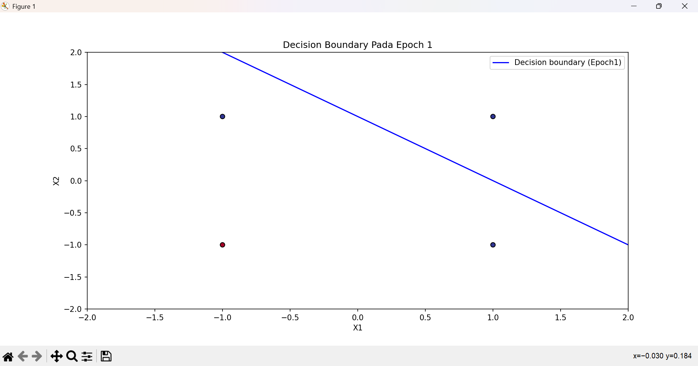
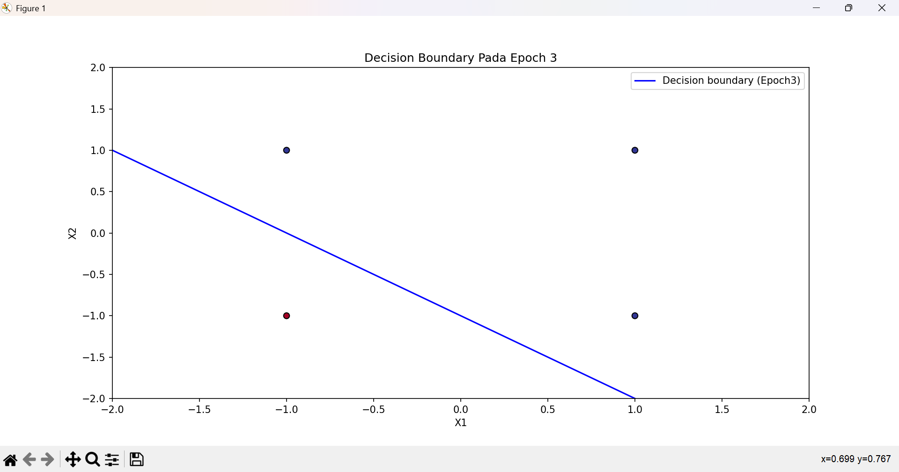

# Praktikum 6 — Jaringan Syaraf Tiruan (JST)
## Struktur File

```
H1D02413-PraktikumKB-Pertemuan6/
├── assets/                        # Folder penyimpanan grafik hasil training
│   ├── sse_backpro.png            # Grafik Perbaikan Error Backpropagation
│   ├── boundary_e1.png            # Decision Boundary Perceptron Epoch 1
│   ├── boundary_e2.png            # Decision Boundary Perceptron Epoch 2
│   └── boundary_e3.png            # Decision Boundary Perceptron Epoch 3
├── Perceptron.py                  # Kelas Perceptron — logika model & training
├── Perceptron_or.py               # Runner masalah OR menggunakan Perceptron
├── Backpropagation.py             # Kelas Backpropagation — logika model & training
├── Backpropagation_xor.py         # Runner masalah XOR menggunakan Backpropagation
├── HasilPerceptron.txt            # Log output training Perceptron per epoch
└── HasilBackpropagation.txt       # Log output training Backpropagation per epoch
```

---

## Cara Kerja Kode

### Perceptron (`Perceptron.py`)

Perceptron menggunakan **Delta Rule** untuk memperbarui bobot. Fungsi aktivasi yang digunakan adalah **bipolar step** (output `1` atau `-1`). Model ini belajar dengan cara menggeser garis pemisah (*decision boundary*) setiap kali terjadi kesalahan prediksi, hingga semua data terklasifikasi dengan benar.

### Backpropagation (`Backpropagation.py`)

Menggunakan algoritma yang lebih kompleks dengan **hidden layer**. Prosesnya melibatkan:

- **Forward Propagation** — menghitung output dari input menuju output layer.
- **Backward Propagation** — menyebarkan error kembali ke tiap layer menggunakan turunan fungsi **tanh**.

Hal ini memungkinkan model mempelajari pola non-linear yang tidak bisa diselesaikan oleh Perceptron biasa.

---

## Arsitektur Model

| Model | Jenis Layer | Kemampuan |
|---|---|---|
| **Perceptron** | Single layer | Hanya untuk masalah *linearly separable* (contoh: gerbang OR) |
| **Backpropagation** | Multi-layer | Mampu menyelesaikan masalah non-linear (contoh: gerbang XOR) |

---

## Hasil Training

### 1. Masalah XOR — Backpropagation

Model Backpropagation diuji untuk menyelesaikan masalah XOR yang bersifat non-linear.



**Analisis:**

- **Konvergensi:** Model berhasil konvergen pada **Epoch 377** dengan error akhir sebesar **0.0010**.
- **Karakteristik:** Penurunan error paling signifikan terjadi pada **50 epoch pertama**, sebelum akhirnya melandai menuju nilai target.

---

### 2. Masalah OR — Perceptron

Berikut adalah visualisasi bagaimana Perceptron memperbarui garis pemisahnya (*decision boundary*) dari epoch awal hingga stabil:

| Epoch 1 | Epoch 2 | Epoch 3 |
|:---:|:---:|:---:|
|  |  |  |

**Analisis:**

- **Epoch 1:** Garis pemisah masih belum tepat — titik merah (`-1`) dan biru (`1`) belum terbagi sempurna.
- **Epoch 2:** Model mulai menyesuaikan bobot; garis mulai bergeser mendekati posisi ideal.
- **Epoch 3:** Garis sudah berada di posisi optimal yang memisahkan kedua kelas secara linear. Training berhenti karena SSE telah mencapai **0**.

---

## Menjalankan Program

### 1. Install dependensi

```bash
pip install numpy matplotlib
```

### 2. Jalankan Perceptron (masalah OR)

```bash
python Perceptron_or.py
```

> Menghasilkan log training di `HasilPerceptron.txt` dan grafik decision boundary di folder `assets/`.

### 3. Jalankan Backpropagation (masalah XOR)

```bash
python Backpropagation_xor.py
```

> Menghasilkan log training di `HasilBackpropagation.txt` dan grafik SSE di folder `assets/`.

---

